```{r setup, include=FALSE}
knitr::opts_chunk$set(echo = TRUE)
```

# **Table of Contents**

|     |
|-----|
|     |

## **1. Overview**

CVARS application helps to explore data visually and makes it easier to identify interesting data patterns.

By uploading data locally or can use default CDISC data, user can explore relevant tables, listings, and figures by giving their own inputs, thus interacting with the data and the analysis.


```{r, echo=FALSE, out.width="100%", fig.align='center'}
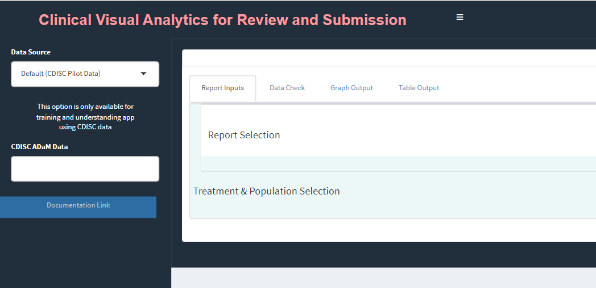
```

This is the look and feel of the CVARS application initially when one loads the app. Now that the app is ready to use, the user needs to feed in the data for which the report and graphs are visualized. There are 5 tabs in the main window: `Report Inputs` to give inputs for reports, `Files & Lot` to show the list of available datasets for the selected study, `Data Check` to view the reported values for the selected variable, `Graph Output` to display any graph generated, and `Table Output` to display any table generated. 

|     |
|-----|
|     |


### 1.1 Data Import

Data can be uploaded from *Local* location. The file can only be of ".csv", ".sas7bdat", ".xpt" and ".Rda" format and must follow the naming convention of "adXX" where "XX" is the domain code. For example, "adae.sas7bdat" and "adae.xpt" are valid whereas "adae_s1.sas7bdat" or "adae2.sas7bdat" are not valid. In the *Data Source* panel, you can see the following options: Default, and Local.

|     |
|-----|
|     |


#### 1.1.1 Default CDISC data

This option provides an opportunity to work with the built-in dataset in the CVARS application. Default option includes ADSL and ADAE dataset. For example, to start working with "ADSL" dataset, choose "ADSL" from C`DISC ADaM Data` dropdown and then click on "Read Data".

```{r, echo=FALSE, out.width="100%", fig.align='center'}
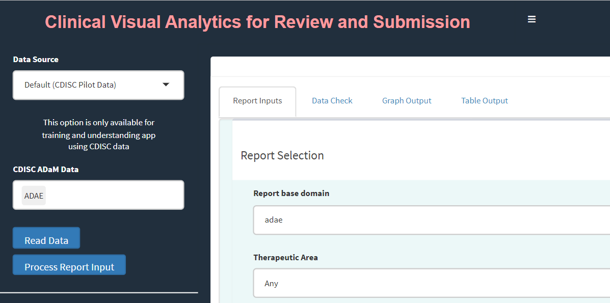
```

Before process or create a report, click on "Report Inputs" tab. This step provides available options to create or process a report. 

|     |
|-----|
|     |

## **2. Reports**

Once the data has been read, the app processes the domain name and allows you to choose the corresponding reports available for those domains.

|     |
|-----|
|     |

**Note**:  Before proceeding to this section, it is highly recommended to review sections `1.1 Data Import` and `1.1.1 Default CDISC data` for further details about giving report inputs. 


|     |
|-----|
|     |

### 2.1 Volcano and Forest

Once `ADAE` data is uploaded, user will have drop-down with Volcano and Forest reports available. Both Volcano and Forest reports yield a Graph Output and a Table Output (common to both, more later)

Data import, Report Selection and Treatment variable Selection


|     |
|-----|
|     |

#### 2.1.1 Volcano Plot


This section presents detailed the steps for creating Volcano Plot using CVARS application which is a graph report. The required input `ADaM` data for this is an `ADAE` dataset.


Upon loading the CVARS  application, please select the `Data Source`and load the `ADAE` data.

```{r, echo=FALSE, out.width="100%", fig.align='center'}
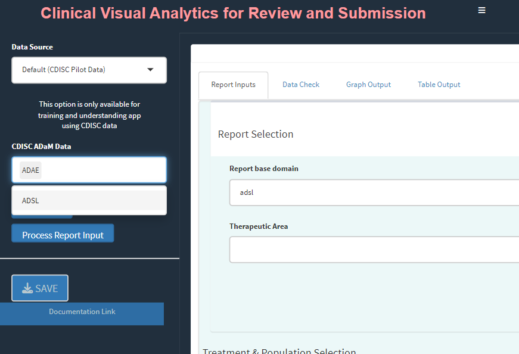
```

Upon loading/selecting `ADAE` data and clicking the Report Inputs tab, report inputs can be added.

```{r, echo=FALSE, out.width="100%", fig.align='center'}
knitr::include_graphics("adae_report_input.png")
```

  - Report Type as `Figure` and Report Name as `Volcano Plot` for the graph  
  
```{r, echo=FALSE, out.width="100%", fig.align='center'}
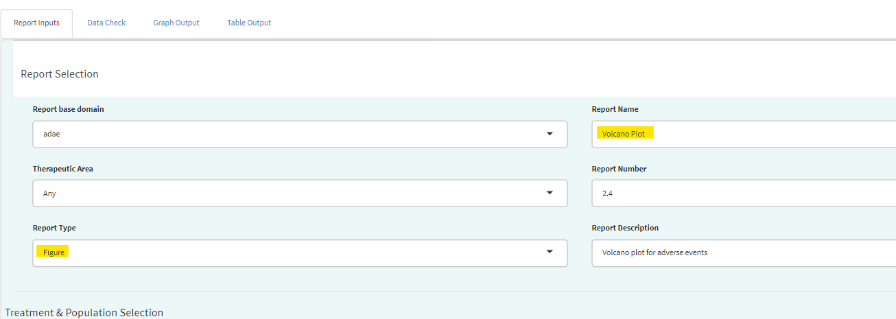
```

**Treatment/Population**  
*Required*  

  - Under Treatment and Population Selection, select appropriate `Treatment Variable`:   
    For table, Treatment Variable determines the columns and for Figure, determines how to         differentiate groups by color.
    
  - Select appropriate `Treatment Sort Variable` which will give the order for sorting             Treatment variable.
  
  - To subset entire data based on population flags, select `Population Filter`. eg. Overall,      Safety (SAFFL).

```{r, echo=FALSE, out.width="100%", fig.align='center'}
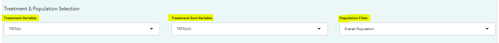
```


**Processing Data:**  

  - Add or Edit the default `Analysis Subset Condition` and `Denominator Subset Condition` to      filter input data (for calculating categorical counts alone or for entire data                 respectively)
  
```{r, echo=FALSE, out.width="100%", fig.align='center'}
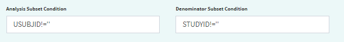
```

  - Select `Adverse Event Filter(s)` - To filter input data

  - Select `Period` - To generate the figure by either `Overall Duration` or `Other`.
  
  - Select `Summary By` - It helps to select either `Participants` if the plot is to based on subject count or `Events` if the plot is to based on AE counts.
  
  - Select `Lower Level Event Term` - This variable will help to generate the figure by           AEBODSYS or FMQ Name etc., It is a type of scatterplot that shows statistical significance (P-value) versus magnitude of change (fold change).
  
  - Select `Lower Level Event Term` - This variable will help to generate the figure by           AEDECOD or AELLT etc., It is a type of scatterplot that shows statistical significance (P-value) versus magnitude of change (fold change). 
  
  - select `Measure of Association` - To generate the plot by either `Risk Ratio` or `Risk Difference`.
  
  - Select `Control Group` - To choose the control treatment to compare with treatment 
  
  - Select `Treatment Group` - To choose the treatment to compare with control
 
  - Update the `p Value Cutoff`, `Alpha Value(CI)`, `Risk Reference Lines` and `Cutoff of Incidence (%)` as desired to generate the plot. 
 
 
```{r, echo=FALSE, out.width="100%", fig.align='center'}
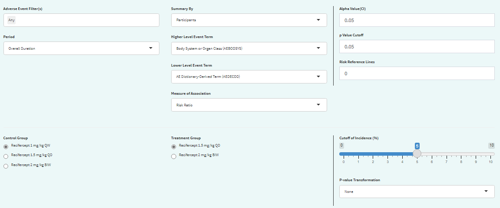
```

**Graph Output:**

- Click `Process Report Input` button and switch to `Graph Output` tab to generate the graph.

  
```{r, echo=FALSE, out.width="70%", fig.align='center'}
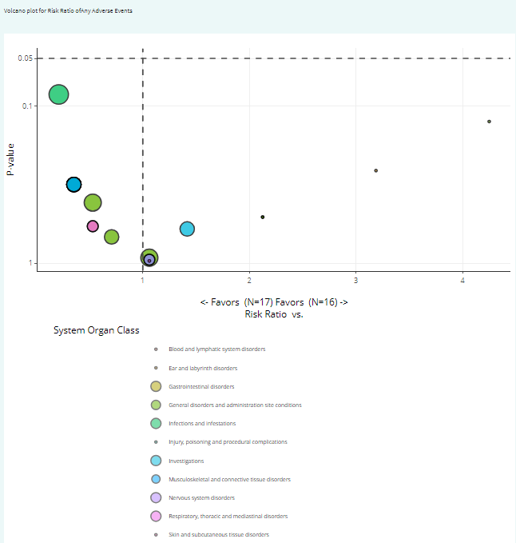
```


|     |
|-----|
|     |

**Note**:  Before proceeding to this section, it is highly recommended to review sections `1.1 Data Import` and `1.1.1 Default CDISC data` for further details about giving report inputs. 
 

|     |
|-----|
|     |

#### 2.1.2 Forest Plot

This section pertains to creating Forest Plot of Adverse Events using the CVARS application. The required input `ADaM` data for this is an `ADAE` dataset.  


Upon loading `ADAE` data and clicking the Report Inputs tab, select Report Type as `Figure` and Report Name as `Forest Plot`  

```{r, echo=FALSE, out.width="100%", fig.align='center'}
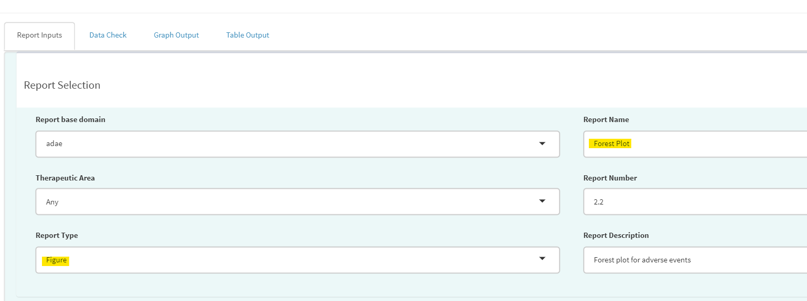
```

**Treatment/Population**  
*Required*  

  - Under Treatment and Population Selection, select appropriate `Treatment Variable`:   
  Treatment Variable determines grouping of points in the scatter plot section as well as treatment pairs in the risk forest section.  
  - Select appropriate `Treatment Sort Variable` which will give the order for sorting Treatment variable  
  - To subset entire data based on available population flags, select `Population Filter`. eg. Overall, Safety (SAFFL) etc  
  
```{r, echo=FALSE, out.width="100%", fig.align='center'}
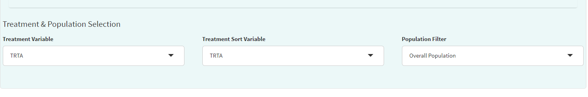
```
  
**Data Pre-processing/Preparation**  
*Optional - Can use defaults*

  - `Analysis Subset Condition` is the filter condition for the data to get counts of participants/events for each treatment.  
  - `Denominator Subset Condition` is the filter condition for the data to calculate percentages of participants/events for each treatment.  
  - `Adverse Event Filter(s)` , select which adverse events are to be filtered for analysis from the list available in the data.  
  - `Period` drop-down to filter the required time period alone select 'Overall Period' to take entire data or 'Other' to specify the residual period (in days) to cut off.    
  
```{r, echo=FALSE, out.width="100%", fig.align='center'}
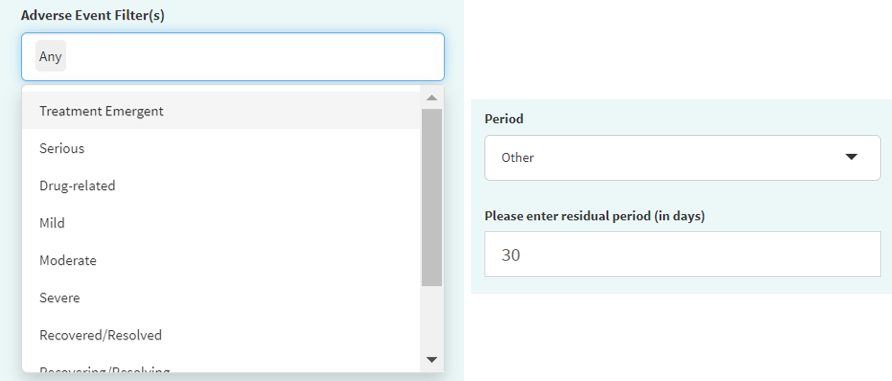
```
  
  - `Summary By` to select either 'Patients' or 'Events' which determines how counts are calculated.
  - `Lower Level Event Term` - Variable which gives the list of adverse event terms to be analysed and displayed in the plot  
  - `Higher Level Event Term` - Variable that is used for grouping Lower Level Term, its values will be reflected in the Hover information for each term.  
  
  
```{r, echo=FALSE, out.width="100%", fig.align='center'}
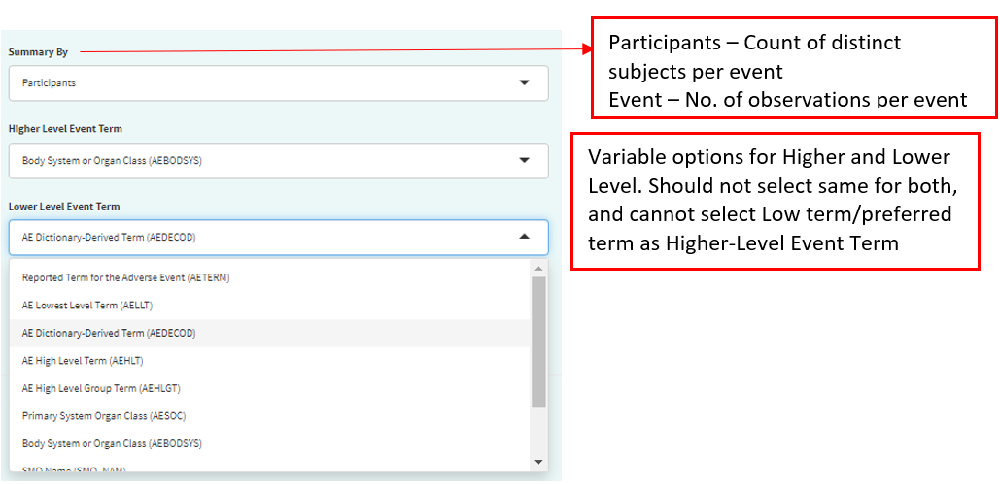
```
  
**Statistical Analysis**  

  - `Measure of Association` - which statistic to calculate, 'Risk Difference' or 'Risk Ratio'  
  - `Alpha Value(CI)` - Give the alpha value to determine Confidence Interval. eg. 0.05 --> 95% CI  
  - `p Value Cutoff` - The p-value below which to consider the any difference in % as statistically significant.  
  - `Risk Reference Lines` - X axis intercept value to draw a vertical reference line in pair-wise risk plot.  
  - `Risk Axis Scale` - How to transform risk axis to be plotted - log or identity (values as is) scales  
  
```{r, echo=FALSE, out.width="90%",,out.height="90%",fig.align='center'}
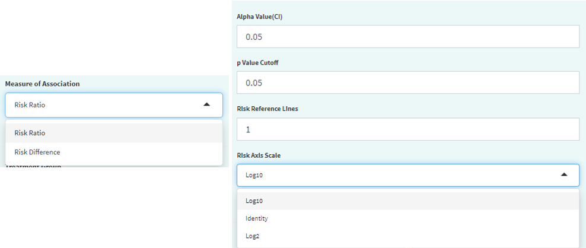
```
    
 - `Control Group` - Select treatment value within Treatment Variable to use as control for analysis  
 - `Treatment Group` - Select treatment value(s) to perform pair-wise analysis against Control. Selecting multiple treatments will result in displaying multiple pairs, eg. Control-Treatment1 and Control-Treatment2 pairs in this case.  
 
```{r, echo=FALSE, out.width="100%", fig.align='center'}
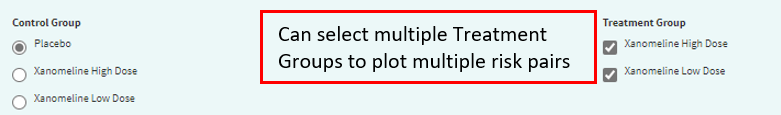
```

**Graphical Display Options**  

  - `Cutoff Incidence` - Slide to the minimum % incidence a term should have (either in control or treatment group) to be displayed in the graph. Those with lower values will be removed.  
  - `p-value Transformation` - Transform p-values displayed in graph for each term - None or log transform.  
  - `Sorting Option` - Order in which to sort the Adverse Event terms in plot - Ascending, Descending (using `Sorting Variable`) or Alphabetical.  
  - `Sorting Variable` - Which parameter/measure should be used to sort the terms in the plot in order of `Sorting Option`  
  
```{r, echo=FALSE, out.width="100%", fig.align='center'}
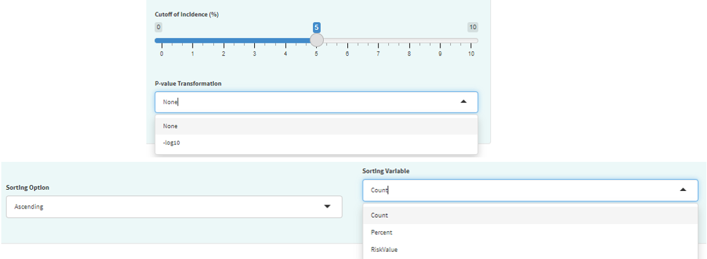
```


**Graph Output**  

For selected options, visualize Forest Plot in Graph Output tab. Note that the color legend identifies the risk pairs in forest graph as well as p-value columns. In the incidence scatterplot, certain points are also depicted with larger green and red points which denotes a statistically significant (per p value cutoff) lower or higher incidence % respectively, for the treatment group vs control.  

```{r, echo=FALSE, out.width="100%", fig.align='center'}
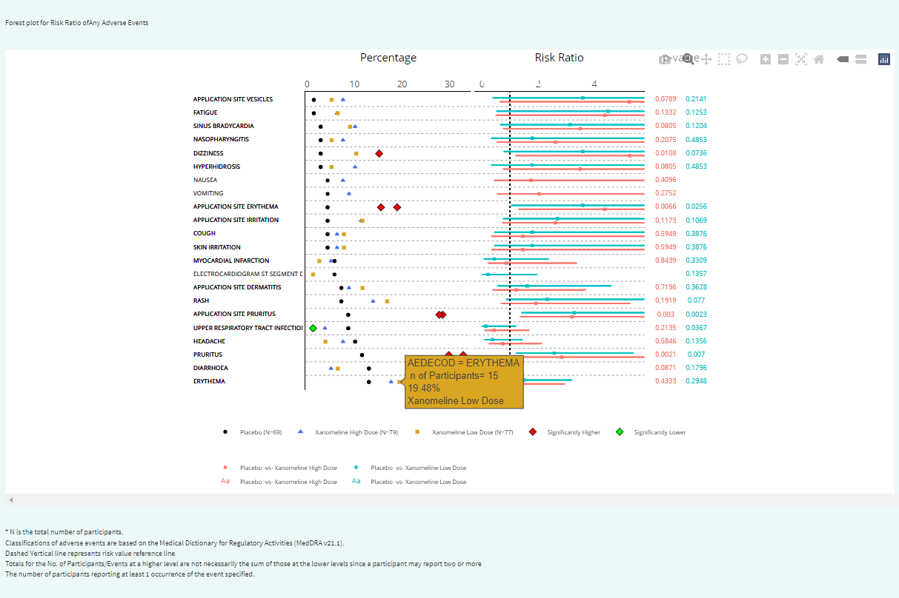
```


|     |
|-----|
|     |


### 2.2 Event Analysis

|     |
|-----|
|     |

**Note**:  Before proceeding to this section, it is highly recommended to review sections `1.1 Data Import` and `1.1.1 Default CDISC data` for further details about giving report inputs. 


|     |
|-----|
|     |

This document details the steps for creating Event Analysis Plot using A&R application which is a graph report. The required input ADaM data for this is an ADAE dataset.

#### 2.2.1 Report Inputs in App

Upon loading the CVARS application, please select the `Data Source` and load the data.

```{r, echo=FALSE, out.width="100%", fig.align='center'}

```


Upon loading/selecting `ADAE` data and clicking Report Inputs tab, report inputs can be added.

```{r, echo=FALSE, out.width="100%", fig.align='center'}
knitr::include_graphics("adae_report_input.png")
```

  - Report Type as `Figure` and Report Name as `Event Analysis` for the graph  
  
```{r, echo=FALSE, out.width="100%", fig.align='center'}
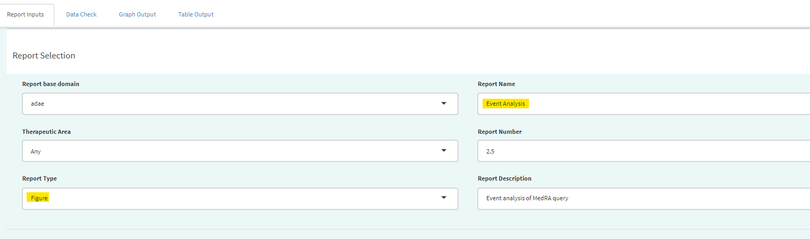
```

 
|     |
|-----|
|     |

**Treatment/Population**  
*Required*  

  - Under Treatment and Population Selection, select appropriate `Treatment Variable`:   
    For table, Treatment Variable determines the columns and for Figure, determines how to         differentiate groups by color.
    
  - Select appropriate `Treatment Sort Variable` which will give the order for sorting             Treatment variable.
  
  - To subset entire data based on population flags, select `Population Filter`. eg. Overall,      Safety (SAFFL).

```{r, echo=FALSE, out.width="100%", fig.align='center'}

```

|     |
|-----|
|     |

**Processing Data:**  

  - Add or Edit the default `Analysis Subset Condition` and `Denominator Subset Condition` to      filter input data (for calculating categorical counts alone or for entire data                 respectively)
  
```{r, echo=FALSE, out.width="100%", fig.align='center'}

```

  - Select `Adverse Event Filter(s)` - To filter input data

  - Select `Period` - To generate the figure by either `Overall Duration` or `Other`.
  
  - Select `Higher Level Event Term` - This variable will help to generate the figure by          AEBODSYS or FMQ Name etc., It shows the main bar chart of the percentages of subjects with     at least one AE, by AEBODSYS or FMQ Name etc., and treament group.
  
  - Select `Lower Level Event Term` - This variable will help to generate the figure by           AEDECOD or AELLT etc., It shows the main bar chart of the percentages of subjects with        at least one AE, by AEDECOD or AELLT etc., and treatment group. 
  
 - Select `Reference Line (%)` - Reference lines show how the data in a chart compares to a      reference value. This is free text column where you can enter any number as reference         value. 
 
```{r, echo=FALSE, out.width="100%", fig.align='center'}
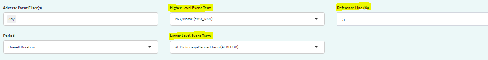
```

|     |
|-----|
|     |

**Graph Output:**

- Click `Process Report Input` button and switch to `Graph Output` tab to update the inputs below and generate the graph.
  
 - Select `Event Higher Classification` - This is related to the `Higher Level Event Term` variable. It creates a drop down of the variable values selected in the `Higher Level Event Term`. 
 
  - Select `Event Term` - This is related to the `Lower Level Event Term` variable. It creates a drop down of the variable values selected in the `Lower Level Event Term`. 
  
```{r, echo=FALSE, out.width="100%", fig.align='center'}
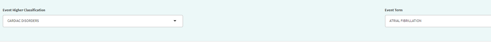
```


```{r, echo=FALSE, out.width="100%", fig.align='center'}
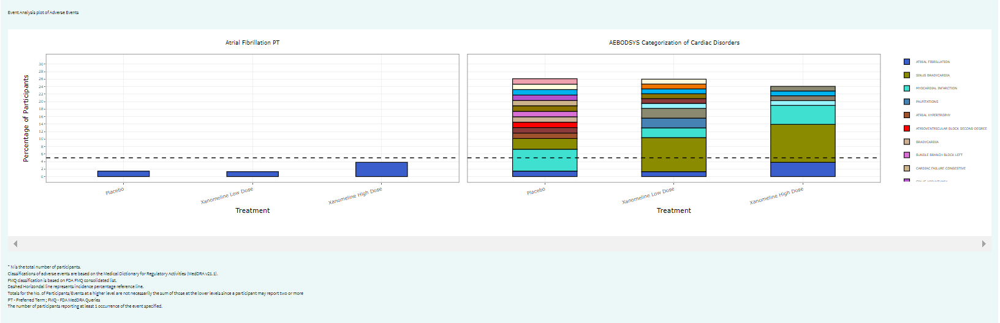
```

|     |
|-----|
|     |

### 2.3 adae_r001 report

|     |
|-----|
|     |

**Note**: Before proceeding to this section, it is highly recommended to review sections `1.1 Data Import` and `1.1.1 Default CDISC data` for further details about giving report inputs. 

|     |
|-----|
|     |

This document pertains to creating a Summary table of Adverse Events i.e `adae_r001` report using the CVARS application. The required input ADaM data for this is an `ADAE` dataset.

#### 2.3.1 Report Inputs in App

Upon loading `ADAE` data and clicking the Report Inputs tab, select Report Type as `Table` and Report Name as `adae_r001`  

```{r, echo=FALSE, out.width="60%", fig.align='center'}
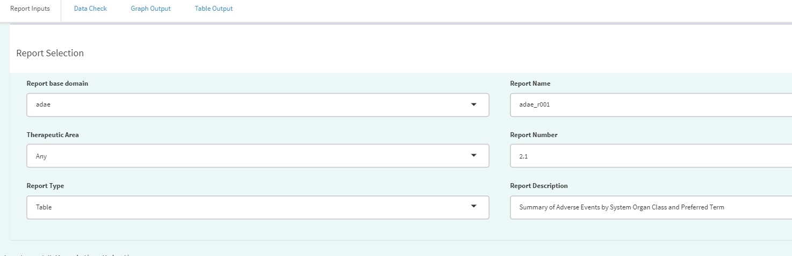
```

**Treatment/Population**  
*Required*  

  - Under Treatment and Population Selection, select appropriate `Treatment Variable`:   
  This groups the data treatment-wise and each treatment will reflect in the columns of the table.  
  - Select appropriate `Treatment Sort Variable` which will give the order for sorting Treatment variable  
  - To subset entire data based on available population flags, select `Population Filter`. eg. Overall, Safety (SAFFL) etc  
  
```{r, echo=FALSE, out.width="70%", fig.align='center'}
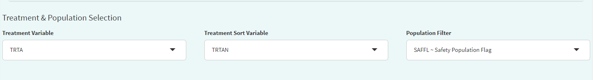
```
**Data Pre-processing/Preparation**  
*Optional - Can use defaults*

  - `Analysis Subset Condition` is the filter condition for the data to get counts of participants/events for each treatment.  
  - `Denominator Subset Condition` is the filter condition for the data to calculate percentages of participants/events for each treatment.  
  - `Percentage Denominator` - What denominator to use to calculate % of each terms for the table? 'Treatment' - within each treatment group and 'Total' - within variable total. If `Calculate Risk` = Y, then this is fixed as 'Treatment' in order to calculate Risk Statistic.  
  - Select Y/N for:  
  
    - `Treatment Big N` - To append to Treatment column names the total count of each group in the format (N = count) or not.  
    - `Total Treatment` - To create an extra column for total of all treatment groups/make it available for pair-wise selection in case of `Calculate Risk` = Y.  
    - `Add Missing Grouping Variable?` - Whether empty/NA values of grouping (`Higher Level Event Term`) variable are to be included or not.  
    - `Calculate Risk` - determines the type of table:  
      
      - If 'N', then all Treatments are displayed with Counts and % of the Adverse Event terms for each, in the table.  
      - If 'Y', then user selects a single Treatment Pair to display Counts and % for as well as Risk Difference or Risk Ratio for the pair.  
      
  
```{r, echo=FALSE, out.width="80%", fig.align='center'}
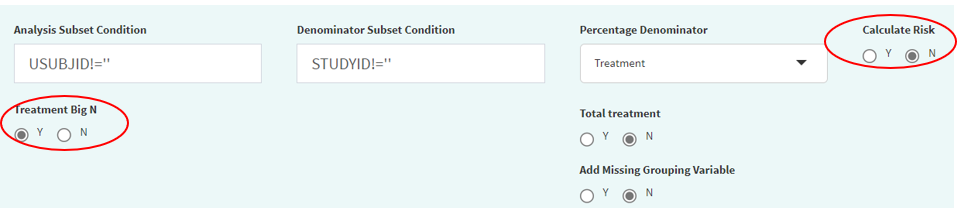
```
  
  - `Adverse Event Filter(s)` , select which adverse events are to be filtered for analysis from the list available in the data.  
  - `Period` drop-down to filter the required time period alone select 'Overall Period' to take entire data or 'Other' to specify the residual period (in days) to cut off.    
  
```{r, echo=FALSE, out.width="80%", fig.align='center'}

```
  
  - `Summary By` to select either 'Participants' or 'Events' which determines how counts are calculated.
  - `Lower Level Event Term` - Variable which gives the list of adverse event terms to be analysed and displayed in the table.  
  - `Higher Level Event Term` - Variable that is used for grouping Lower Level Term, its values in the table will divide the Lower Level Event Term variable into groups, with the Higher Level terms displayed in **bold**.  
  
  
```{r, echo=FALSE, out.width="90%", fig.align='center'}

```
  
**For table with Risk - if `Calculate Risk` = 'Y':**  

  - `Measure of Association` - which statistic to calculate, 'Risk Difference' or 'Risk Ratio'  
  - `Alpha Value(CI)` - Give the alpha value to determine Confidence Interval. eg. 0.05 --> 95% CI  

```{r, echo=FALSE, out.width="60%",fig.align='center'}
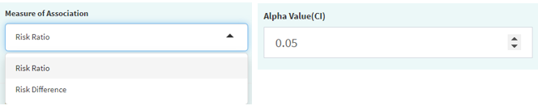
```
    
 - `Control Group` - Select treatment value within Treatment Variable to use as Control for analysis  
 - `Treatment Group` - Select treatment value to perform pair-wise analysis against Control. 
 
```{r, echo=FALSE, out.width="60%", fig.align='center'}
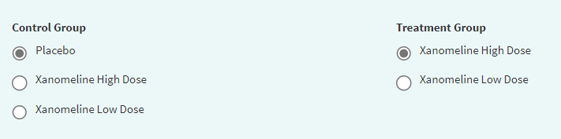
```

**Display Options**  

  - `Cutoff Incidence` - Slide to the minimum % incidence a term should have (in any of the selected treatment groups) to be displayed in the table Those with lower values will be removed.  
  - `Sorting Option` - Order in which to sort the Adverse Event terms in plot - Ascending, Descending (using `Sorting Variable`) or Alphabetical.  
  - `Sorting Variable` - Which parameter/measure should be used to sort the terms in the plot in order of `Sorting Option`  
  
```{r, echo=FALSE, out.width="80%", fig.align='center'}
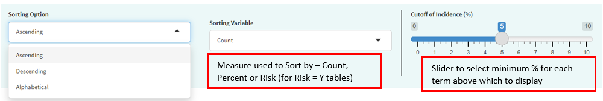
```


**Table Output:**  

After selecting options, click 'Process Report Input' to view the table in Table Output tab.  

**Table with Risk Statistic**  
*Sorted in Ascending Order of Count*  

```{r, echo=FALSE, out.width="100%", fig.align='center'}
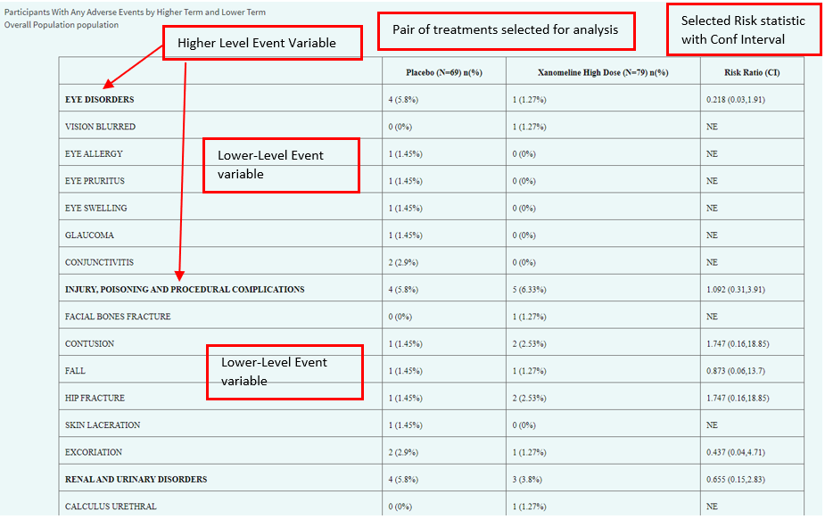
```

**Table without Risk Statistic**  
*Sorted in Descending Order of Count*  

```{r, echo=FALSE, out.width="100%", fig.align='center'}
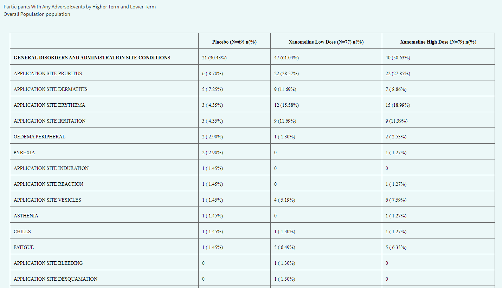
```


## **3. Save Reports**

All the tables and graphs generated can be saved outside of the application. After an output is generated, below 'Process Report Input ' button you will see 'Save'.

Table can be saved in 3 formats wherease Figure in 5 formats. HTML will contain the plot as an interactive widget.

After selecting a format and Table/Figure, click the 'Save' button and you will be able to download the selected report into a local path. In future this will expand to save in network locations.

|     |
|-----|
|     |

## **4. Usage Notes and Common Errors**

-   When subset conditions, population or adverse event filters are selected, check that there is any data within those filters. If not, reports may fail or display a message that there is no data.

-   For running an analysis with pooled data, user has the option to give STUDYID as Treatment Variable.

-   If the app fails at some point, the 'Logs' in R Studio Connect or R Studio can also give a clue about the source of the error.

|     |
|-----|
|     |

## **5. App Development Details**

R version 4.1.0 Packages: cowplot : 1.1.1; data.table : 1.14.2; DT : 0.26; epitools : 0.5-10.1; flextable : 0.8.2; ftExtra : 0.4.0; ggstance : 0.3.5; haven : 2.5.1; htmltools : 0.5.3; officer : 0.4.4; plotly : 4.10.0; RCurl : 1.98-1.8; readxl : 1.4.1; scales : 1.2.1; shiny : 1.7.2; shinycssloaders : 1.0.0; shinydashboard : 0.7.2; shinyjs : 2.1.0; shinyWidgets : 0.7.4; tidyverse : 1.3.2; tools : 4.1.0

|     |
|-----|
|     |
